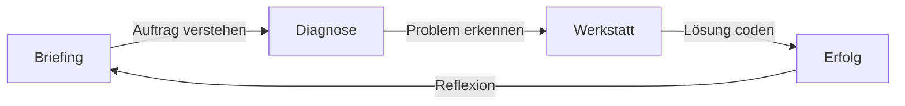

# Frontend Hero
## Eine interaktive "Rescue Mission" für CSS-Einsteiger

---

## 1. Der Kontext
**Lernfeld 6:** Digitale Medienprodukte konzipieren, gestalten und realisieren.
- **Zielgruppe:** 2. Ausbildungsjahr (Mediengestalter / Technologen).
- **Lehrplan-Bezug:** Umsetzung von Prototypen mittels standardisierter Sprachen (HTML/CSS).
- **Kompetenzziel:** Vom bloßen "Abtippen" zum echten Verständnis von Ursache und Wirkung.

---

## 2. Das Problem
**"The Visual Gap"**
Einsteiger kämpfen mit der Abstraktionslücke:
1.  **Codeebene:** Abstrakte Syntax (`padding: 20px;`)
2.  **Visuelle Ebene:** Das Ergebnis im Browser.
3.  **Die Hürde:** Das mentale Modell fehlt. Kausalitäten sind unsichtbar.

> **Folge:** Ineffizientes "Raten" (Trial-and-Error) statt systematisches Debugging.

---

## 3. Die Lösung: "Frontend Hero"
Statt auf einer leeren Seite zu beginnen, werden die Lernenden zu **Rettern**.

- **Ansatz:** "Broken Build" statt "Greenfield".
- **Szenario:** Ein defektes Produkt muss repariert werden.
- **Didaktik:**
  - **Analysieren:** Was weicht vom Soll-Zustand ab? (Diagnose)
  - **Verstehen:** Warum ist es kaputt? (Quiz/Verständnis)
  - **Beheben:** Wie fixen wir es? (Live-Coding)

---

## 4. Der Workflow (Scaffolding)

Die Anwendung führt die Lernenden durch einen strukturierten Prozess, um Überforderung zu vermeiden.

---

## 5. Phase 1: Das Briefing (Realitätsbezug)
*Simulation eines Arbeitsauftrags*

Die Lernenden erhalten eine "E-Mail" (z.B. von "Lisa aus dem Design") mit einem konkreten Problem.

- **Ziel:** Kontextualisierung der Aufgabe.
- **Elemente:** Visueller Vergleich "Soll vs. Ist".

> *[Hier Screenshot: Ansicht "Posteingang" aus der App einfügen]*

---

## 6. Phase 2: Die Diagnose (Aktivierung)
*Verständnis vor Aktion*

Bevor Code geschrieben wird, muss das Problem analysiert werden.

- **Methode:** Gezielte Fragen zum Problem (Multiple Choice).
- **Ziel:** Verhindern von blindem Rumprobieren. Erst denken, dann handeln.

> *[Hier Screenshot: Ansicht "Diagnose-Quiz" einfügen]*

---

## 7. Phase 3: Die Werkstatt (Umsetzung)
*Die "Three-Pane" Evolution*

Hier wird gearbeitet. Das Interface ist professionell, aber reduziert.

1.  **Editor (Links):** Echter Monaco-Code-Editor mit Syntax-Highlighting.
2.  **Vorschau (Rechts):** Live-Shadow-Preview der Änderung.
3.  **Hilfe (On-Demand):** Kontext-sensitive Hinweise (AI-Prompts, Tipps).

> *[Hier Screenshot: Ansicht "Workbench / Editor" einfügen]*

---

## 8. Didaktische Qualität
Warum funktioniert das?

1.  **Bloom's Taxonomie:** Fokus auf **Analysieren** und **Anwenden**.
2.  **Scaffolding:** Der Prozess wird in verdaubare Schritte zerlegt.
3.  **Instant Feedback:** Jede Code-Änderung ist sofort sichtbar.
4.  **Gamification:** Fortschrittsbalken, "Level-Up"-Gefühl und Rollenspiel-Aspekte motivieren.

---

## 9. Live Demo & Tech Stack

Das Projekt ist eine moderne **Single-Page-Application (SPA)**.

- **Tech:** React, TypeScript, TailwindCSS, Monaco Editor.
- **Status:** Open Source auf GitHub.

🚀 **Jetzt ausprobieren:**
[https://LucaElias.github.io/frontend-hero/](https://LucaElias.github.io/frontend-hero/)

---
*Erstellt für den Einsatz im Berufsschulunterricht.*
